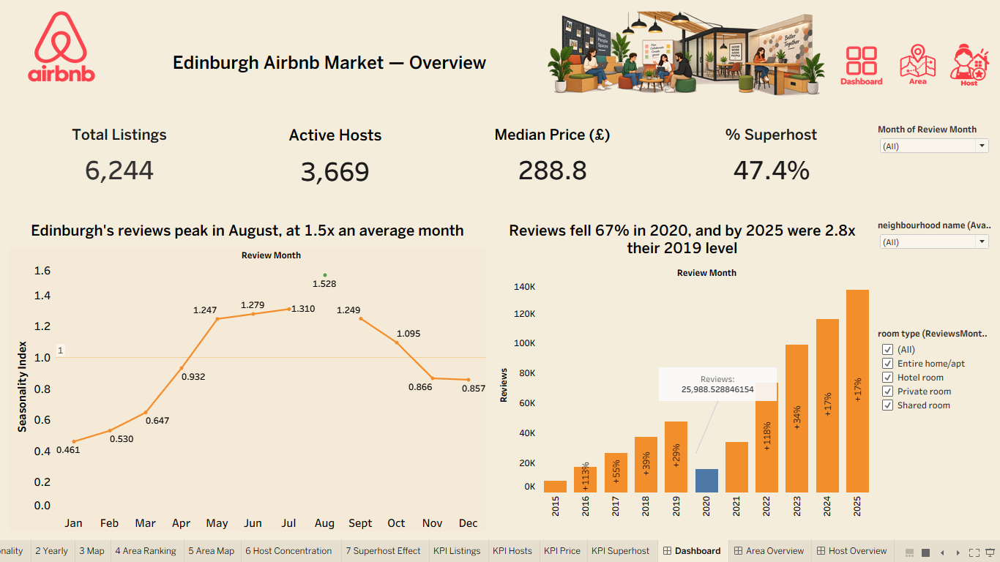
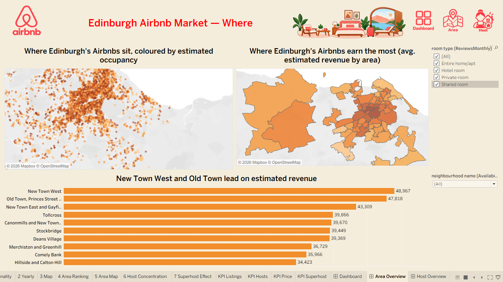
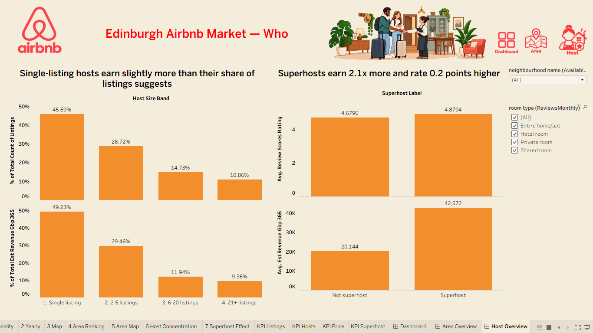

# 🏠 Edinburgh Airbnb Market Analytics

**End-to-end SQL + Tableau analysis of the Edinburgh short-term letting (STL) market** — covering market size, geographic supply, seasonality, and host concentration, built on MySQL and visualized in an interactive Tableau dashboard.


---

## 📌 Project Summary

Edinburgh is one of the UK's most-visited cities and one of the first in Scotland to enforce mandatory **Short-Term Let (STL) licensing**. This project analyzes a full listings, host, and review-level Airbnb dataset for Edinburgh to answer four core business questions:

1. **How big is the market?** — Total listings, active hosts, room-type mix, and rating benchmarks.
2. **Where is the supply?** — Neighbourhood-level concentration, revenue, and occupancy.
3. **When does demand peak?** — Seasonality of guest reviews and forward booking availability.
4. **Who runs the market?** — Host size bands, licensing compliance, and the "professionalization" of the market (single hosts vs. multi-listing portfolios).

All business logic was written in **MySQL** (staging → modelled fact/dimension tables → analytical views), then connected live to **Tableau** for a three-page executive dashboard.

---

## 🧭 Key Findings

| Metric | Value |
|---|---|
| Total active listings | **6,244** |
| Distinct hosts | **3,669** |
| Median nightly price | **£288.8** |
| Share of listings held by Superhosts | **47.4%** |
| Share of listings that are whole "Entire home/apt" | **71.2%** |
| Listings missing a price | **634** |
| Reviews peak month | **August (1.53× an average month)** |
| Review volume, 2025 vs. 2019 | **2.8× higher**, despite a 67% collapse in 2020 |
| Top neighbourhood by revenue | **New Town West** (avg. est. £48,967 / listing / year) |
| Superhost revenue premium | **2.1× higher** than non-Superhosts, and **+0.2** average rating points |
| Licensing (STL number) compliance | Highest among single-listing hosts (69.1%); lowest among 6–20 listing hosts (81.4% missing) |

📄 Full methodology and business context: [`docs/BRD.md`](docs/BRD.md) · [`docs/methodology.md`](docs/methodology.md)

---

## 📊 Dashboard

The Tableau workbook contains three linked pages — **Dashboard (Overview)**, **Area Overview**, and **Host Overview** — each filterable by review month, neighbourhood, and room type.

### 1. Overview — Market Size & Seasonality
KPIs (listings, hosts, price, Superhost share) alongside seasonality index and year-over-year review growth.



### 2. Area Overview — Where the Market Concentrates
Geographic distribution of listings by estimated occupancy, revenue heat map by neighbourhood, and a ranked revenue bar chart.



### 3. Host Overview — Who Runs the Market
Host size bands (single-listing vs. portfolio hosts) compared on share of listings vs. share of revenue, plus the Superhost rating/revenue premium.



> The full interactive `.twbx` workbook is available in [`dashboards/`](dashboards/) — add your published workbook file there (see *Repository Structure* below).

---

## 🗂️ Repository Structure

```
edinburgh-airbnb-analytics/
│
├── README.md                      <- You are here
├── LICENSE
├── .gitignore
│
├── docs/
│   ├── BRD.md                     <- Business Requirements Document
│   ├── data_dictionary.md         <- Field-level definitions of the data model
│   └── methodology.md             <- Data source, workflow & analytical approach
│
├── sql/
│   ├── 01_staging_load.sql        <- Raw data ingestion into staging tables
│   ├── 02_build_model.sql         <- Cleaning, fact/dimension model build
│   ├── 03_edinburgh_story.sql     <- 4-chapter business analysis (Q1–Q8)
│   └── README.md                  <- Notes on running the SQL scripts in order
│
├── dashboards/
│   ├── Edinburgh_Airbnb_Dashboard.twbx   <- Tableau packaged workbook (add yours here)
│   └── images/                    <- Dashboard screenshots used in this README
│       ├── 01_dashboard_overview.png
│       ├── 02_area_overview.png
│       └── 03_host_overview.png
│
└── data/
    └── README.md                  <- Where to source the raw data (not committed — see below)
```

---

## 🔄 Data Source & Workflow

**Source data:** Public Airbnb listings, host, calendar, and reviews data for Edinburgh, UK (the field structure — `room_type`, `review_scores_rating`, `availability_365`, `host_id`, neighbourhood boundaries — follows the standard **Inside Airbnb** open-data schema). Two scrape snapshots were used for forward-looking availability (23 June 2026 and 2 July 2026).


**End-to-end workflow:**

```
Raw CSV extracts (listings / hosts / calendar / reviews)
        │
        ▼
1. STAGING  →  Load raw files into MySQL staging tables, preserve source as-is
        │
        ▼
2. MODELLING  →  Clean types, deduplicate, resolve nulls/outliers,
                 build a fact table (fact_listings) and supporting
                 dimensions (dim_host, dim_neighbourhood, dim_date)
        │
        ▼
3. ANALYSIS  →  Business SQL organized into 4 narrative chapters:
                 Ch.1 Market Size · Ch.2 Geographic Supply ·
                 Ch.3 Seasonality & Availability · Ch.4 Host Structure
                 + a reusable view: vw_neighbourhood_scorecard
        │
        ▼
4. VISUALIZATION  →  Tableau connects live to MySQL / the analytical
                      views, producing the 3-page dashboard above
        │
        ▼
5. INSIGHT & REPORTING  →  Findings summarized in docs/BRD.md and
                            this README for stakeholder consumption
```

---

## 🛠️ Tools & Technologies

| Layer | Tool |
|---|---|
| Data storage & transformation | MySQL 8.0 (MySQL Workbench) |
| Query techniques used | Window functions (`SUM() OVER`, `RANK() OVER`), CTEs, `CREATE VIEW`, aggregate + conditional aggregation |
| Visualization | Tableau (calculated fields, dashboard actions, parameter/filter controls) |
| Version control | Git / GitHub |

---

## ▶️ How to Reproduce

1. Clone this repository.
2. Source the Edinburgh Airbnb data files as described in [`data/README.md`](data/README.md) and place them in `data/raw/`.
3. In MySQL Workbench (or CLI), run the scripts in `sql/` **in order**: `01_staging_load.sql` → `02_build_model.sql` → `03_edinburgh_story.sql`.
4. Open `dashboards/Edinburgh_Airbnb_Dashboard.twbx` in Tableau Desktop/Public and point the data connection at your local `airbnb_analytics` schema.
5. Refresh extracts (if using a Tableau extract rather than a live connection).

---

## 📁 Related Documents

- [Business Requirements Document (BRD)](docs/BRD.md)
- [Data Dictionary](docs/data_dictionary.md)
- [Methodology & Data Workflow](docs/methodology.md)

---

## 👤 Author

Maintained by Saraswati Shinde. Contributions, issues, and suggestions welcome — please open an issue or pull request.

## 📄 License

This project is licensed under the [MIT License](LICENSE). Underlying Airbnb data remains subject to its original source's terms of use.
